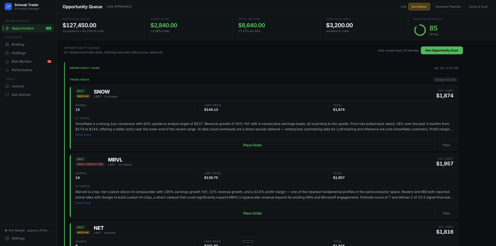
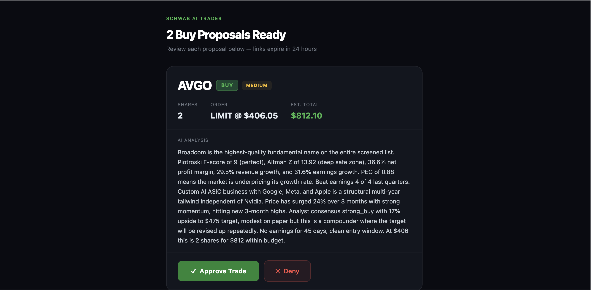
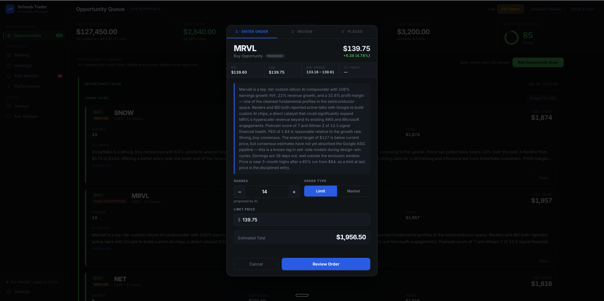
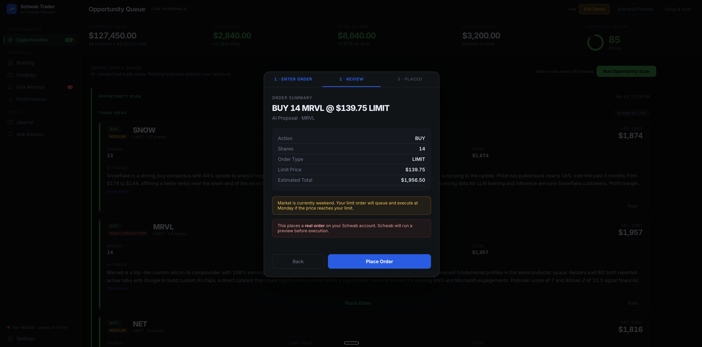
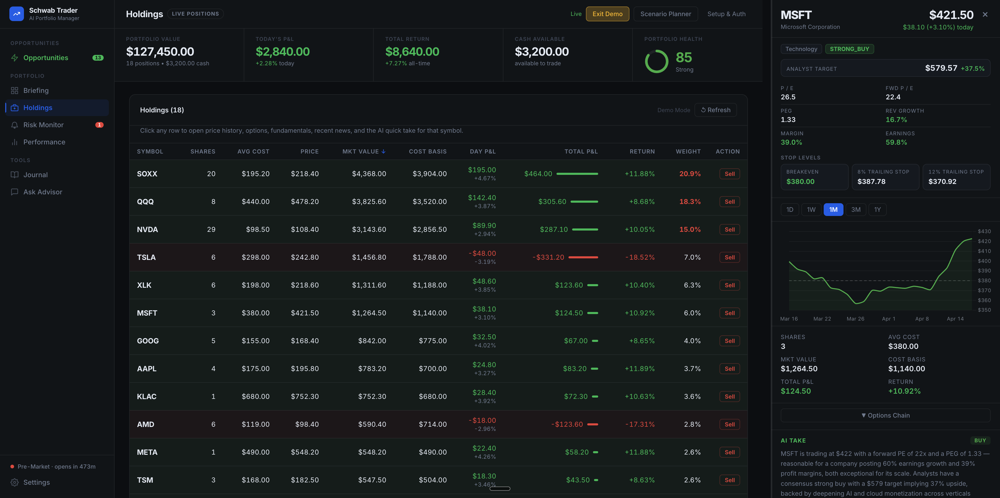
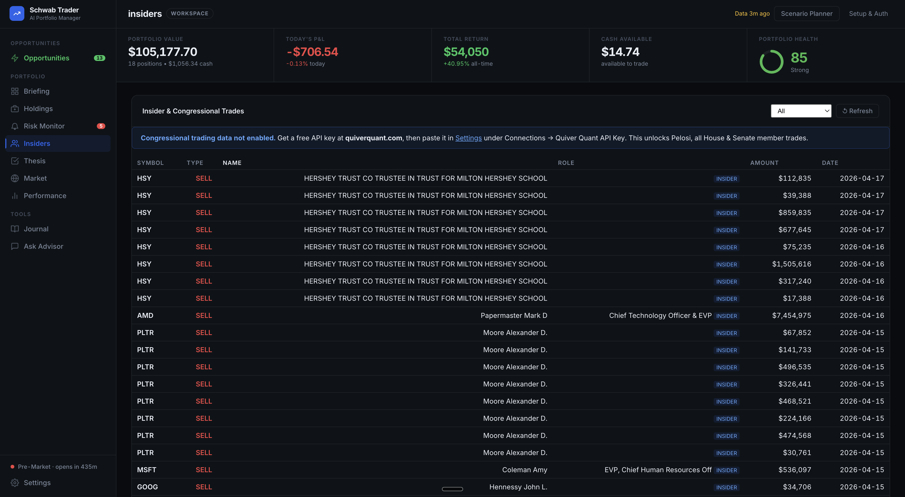
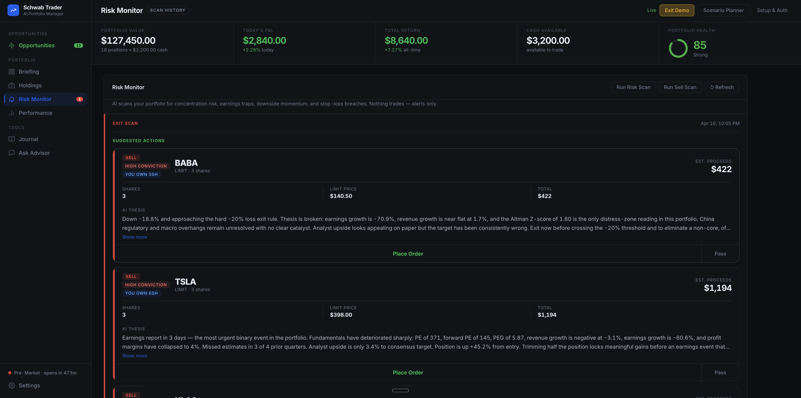
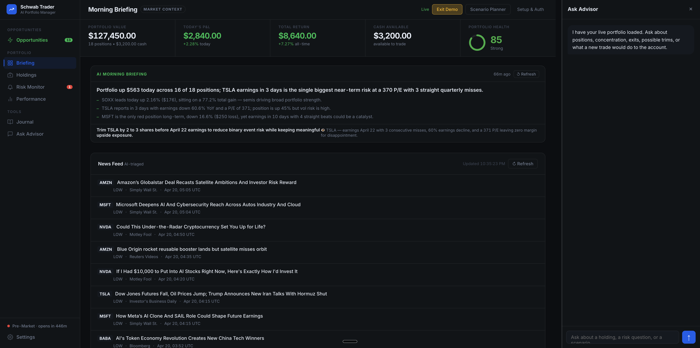
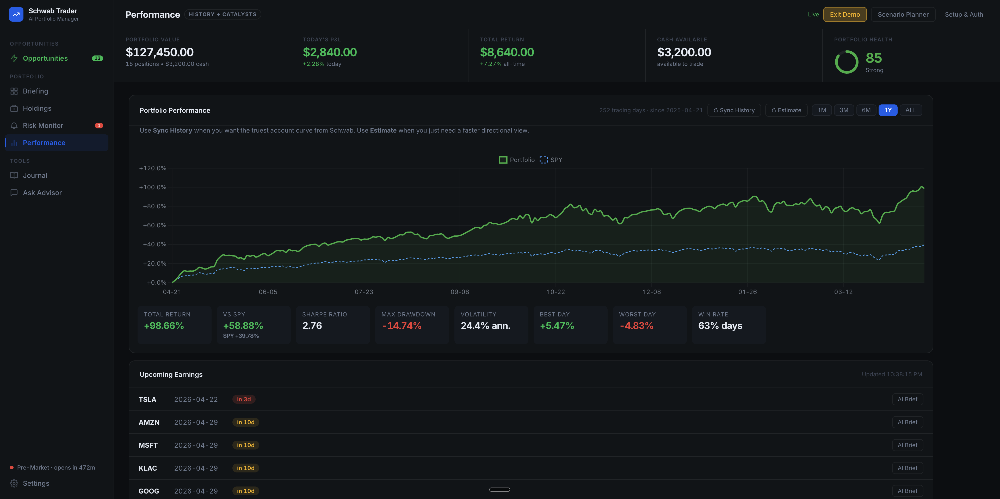
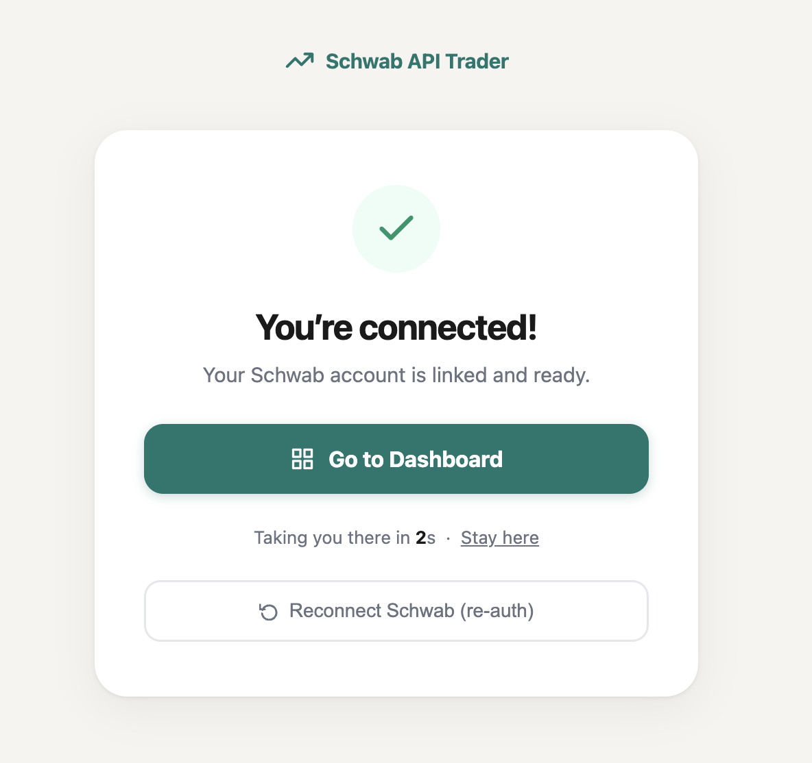

# Schwab AI Trader

An AI-powered trading copilot built on the Charles Schwab API and Claude. Self-hosted, runs on your own machine, your data stays with you.

Every morning at 5 AM Pacific, an AI agent reads the market, checks my positions, scans my watchlist, and sends me a briefing. If it finds a trade worth making, it texts me. I tap Approve. The order goes in.

Not a backtest. Not a paper trading demo. This runs on real money.

---



The dashboard shows AI-researched trade ideas ranked by conviction. Each card has a full thesis written by Claude covering fundamentals, news, analyst upside, and earnings windows. Nothing executes without your approval.

---

## The problem it solves

Managing a portfolio takes attention at the wrong times. Premarket. During earnings. When a position starts sliding at 2 PM on a Tuesday. Most people either overtrade trying to stay on top of it, or check out entirely because life gets in the way.

This watches so I don't have to. It reads news on my positions, checks exit thresholds, monitors concentration risk, and surfaces what needs a decision. I stay in control of every order. The research and the vigilance are handled.

---

## How a trade gets proposed

The buy scan runs on a schedule. Claude pulls live portfolio data, reads fundamentals from EDGAR and yfinance, pulls recent news, and searches the full S&P 500 for candidates — not just a fixed watchlist. Every scan fetches all 503 S&P 500 constituents from Wikipedia, merges them with a curated seed list of high-growth names not yet in the index (PLTR, CRWD, AXON, HIMS, COIN, etc.), scores them by momentum, then runs Morningstar-style quality filters — FCF yield, return on equity, PEG ratio, revenue growth, and analyst upside — on the top movers. The top 15 scorers go to Claude for a 7-step deep research pass. If something meets the buy criteria it generates a proposal and sends it to me as an HTML email with a green **Approve** button and a red **Deny** button.



Tap Approve. A confirmation page loads. Review the details. Hit Place Order. The whole flow works from your phone without opening the dashboard. Tokens expire after 24 hours so nothing stale can get through.

---

## The order flow

Approving a proposal opens a three-step flow: configure shares and order type, review the full order summary, then place it on your Schwab account.





Every order runs through a risk check before it reaches Schwab. Kill switch, daily loss cap, position size limits, max open positions. The guardrails are in code, not willpower.

---

## Your full portfolio, always current

The Holdings view pulls live data directly from Schwab. Positions, day P&L, cost basis, unrealized gains, sector allocation. No manual entry, no syncing. It's your actual account.



---

## Congressional and insider trade tracking

The Insiders tab pulls congressional and corporate insider trades from Quiver Quantitative. See what House and Senate members are buying and selling in real time, alongside executive-level SEC filings for your holdings. Free API key at [quiverquant.com](https://quiverquant.com).



---

## Risk monitoring that never sleeps

The risk monitor scans every 30 minutes while the market is open. It flags concentration risk, positions approaching earnings, drawdowns past exit thresholds, and gains that might be worth locking in. When something needs attention it sends an SMS. When it finds a position that should be cut it generates a sell proposal through the same approve/deny flow.



---

## Every morning starts with a briefing

At 5 AM Pacific a Claude Code agent runs the pre-market routine. It reads macro conditions, checks news on every position, looks at analyst moves, and writes a briefing committed directly to the repo as a markdown file. By the time the market opens I know what to watch.



---

## Performance tracked from real history

The performance page reconstructs your equity curve from actual Schwab order history. No manual logging, no estimates. Toggle between 1M / 3M / 6M / 1Y / ALL, compare against SPY, and see Sharpe ratio, max drawdown, best and worst day, and win rate.



---

## Autonomous daily routines

Five Claude Code agents run on a market schedule deployed on Railway. They call the FastAPI server, do their analysis, and commit findings to a `memory/` directory as plain markdown files. Claude reads those files at the start of every session so it has context without needing a database.

| Routine | Schedule | What it does |
|---|---|---|
| `pre-market.md` | 5:00 AM PT | Macro snapshot, thesis checks, watchlist scan, daily briefing |
| `market-open.md` | 6:45 AM PT | Validates buy signals, triggers buy scan if conditions are met |
| `midday.md` | 9:00 AM PT | News check on positions, exit threshold review, flags anything urgent |
| `daily-summary.md` | 1:15 PM PT | EOD P&L snapshot committed to `memory/TRADE-LOG.md` |
| `weekly-review.md` | Friday 1:00 PM PT | Full week review, alpha vs S&P, rule adherence, strategy notes |

```
Claude Code cloud routines (Railway, scheduled)
    └── scripts/schwab_server.sh        bash wrapper for all server calls
            └── FastAPI server           handles Schwab OAuth and data
                    └── Schwab API       real brokerage

Memory: routines commit memory/*.md to git so Claude has context next session
```

See [`routines/README.md`](routines/README.md) for the full Railway and Claude Code setup.

---

## Tech stack

- **Backend:** Python 3.13, FastAPI, Uvicorn
- **AI:** Anthropic Claude (claude-sonnet-4-6) with a multi-round tool-calling agent loop
- **Brokerage:** Charles Schwab Individual Trader API (OAuth 2.0, PKCE)
- **Market data:** yfinance (fundamentals, FCF yield, ROE, PEG), FRED API, SEC EDGAR
- **Stock discovery:** Full S&P 500 universe fetched dynamically from Wikipedia + curated growth seed list
- **Screening:** Momentum pre-filter → Morningstar-style quality scoring (FCF yield, ROE, PEG, revenue growth, analyst upside)
- **Notifications:** Twilio SMS and SMTP email with HTML approve/deny buttons
- **Frontend:** Vanilla JS, Chart.js, no framework, no build step
- **Deployment:** Railway for the server, Claude Code for the scheduled routines

---

## Architecture

```
schwab_trader/
├── advisor/        # Claude streaming chat with live tool-calling
├── agent/          # Buy/sell scan, risk monitor, alert store
│   ├── monitor.py  # Rule-based flag detection
│   ├── service.py  # Scan orchestration
│   └── tools.py    # get_portfolio, get_news, get_price_history,
│                   # get_earnings_calendar, get_stock_fundamentals
├── auth/           # Schwab OAuth 2.0 and PKCE token management
├── broker/         # Schwab API wrapper
├── execution/      # Kill switch, risk checks, preview, place_order
├── fred/           # FRED macroeconomic data
├── intermarket/    # Cross-asset signal aggregation
├── journal/        # Trade reconstruction and scorecard metrics
├── notifications/  # Twilio SMS and SMTP email with approval tokens
├── performance/    # Equity curve from full order history
├── risk/           # Position risk models and policy engine
├── screening/      # Dynamic S&P 500 universe + Morningstar-style quality scoring
├── thesis/         # AI thesis validation per position
└── server/         # FastAPI app and single-file dashboard HTML
```

---

## Setup

### Prerequisites

- Python 3.13+
- [uv](https://docs.astral.sh/uv/) package manager
- A [Schwab Developer App](https://developer.schwab.com) with Individual Trader API access
- An [Anthropic API key](https://console.anthropic.com)
- **thinkorswim enabled on your Schwab account** (required for API order placement)

> **Important:** The Schwab API will authenticate and return account data just fine without thinkorswim, but live order placement will be rejected with "No trades are currently allowed" until TOS is enabled. To enable it, log in at schwab.com, go to Trade > Trading Platforms, and request thinkorswim access. It updates overnight.

### 1. Clone and install

```bash
git clone https://github.com/ongcpatrick/Schwab-API-Trader-Public.git
cd Schwab-API-Trader-Public
uv sync
```

### 2. Configure

```bash
cp .env.example .env
# Four required keys, everything else is optional
```

**Required:**
```env
SCHWAB_TRADER_SCHWAB_APP_KEY=your_schwab_app_key
SCHWAB_TRADER_SCHWAB_APP_SECRET=your_schwab_app_secret
SCHWAB_TRADER_SCHWAB_CALLBACK_URL=http://127.0.0.1:8000/auth/callback
SCHWAB_TRADER_ANTHROPIC_API_KEY=your_anthropic_api_key
```

**Optional: SMS and email trade approvals**
```env
SCHWAB_TRADER_TWILIO_ACCOUNT_SID=
SCHWAB_TRADER_TWILIO_AUTH_TOKEN=
SCHWAB_TRADER_TWILIO_FROM_NUMBER=
SCHWAB_TRADER_ALERT_PHONE_NUMBER=
SCHWAB_TRADER_EMAIL_SMTP_HOST=smtp.gmail.com
SCHWAB_TRADER_EMAIL_SMTP_USER=you@gmail.com
SCHWAB_TRADER_EMAIL_SMTP_PASSWORD=your_app_password
SCHWAB_TRADER_ALERT_EMAIL_ADDRESS=you@gmail.com
SCHWAB_TRADER_DASHBOARD_URL=http://YOUR_LOCAL_IP:8000
```

**Optional: macroeconomic indicators**
```env
SCHWAB_TRADER_FRED_API_KEY=   # Free at https://fred.stlouisfed.org/docs/api/api_key.html
```

See `.env.example` for the full list including risk guardrails and alert thresholds.

### 3. Start

```bash
./start.sh
```

Open `http://127.0.0.1:8000` to complete Schwab OAuth. Once connected you'll see this screen and get redirected to the dashboard automatically.



---

## Safety

This system places real orders. The guardrails are not optional.

- **Kill switch:** set `SCHWAB_TRADER_LIVE_ORDER_KILL_SWITCH=true` to block all order execution instantly without touching any code
- **Risk policy:** every order checks daily loss limits, position size caps, and max open positions before it reaches Schwab
- **Human in the loop:** nothing executes without your tap on an approve link. The AI proposes, you decide.
- **Token expiry:** approval tokens are single-use and expire after 24 hours
- **Audit log:** every order attempt is written to `.data/audit.jsonl`
- **Credentials stay local:** `.env`, tokens, and trade data are all gitignored

---

## Disclaimer

This is a personal project for educational purposes. It places real orders on your brokerage account. Always review proposals before approving. Past performance does not guarantee future results. This is not financial advice.
